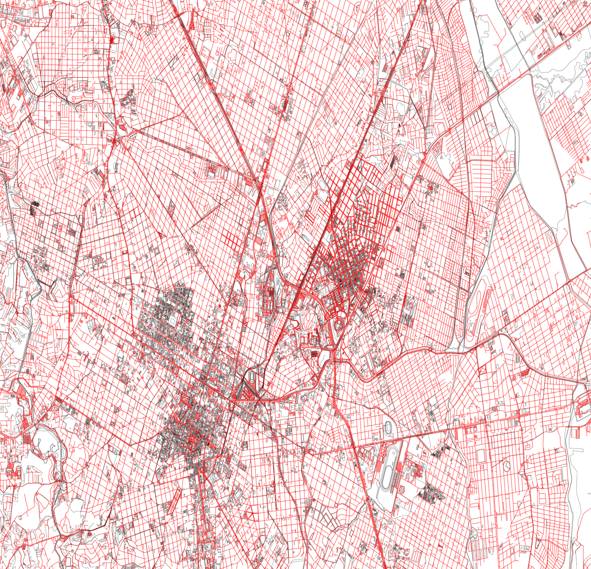

# Grapphs

  

## Performance oriented header-only C++ graph theory library
Grapphs is a library with implementations of graph theory algorithms and data structures  
Some examples include:
* Adjacency list
* Adjacency Matrix
* Pathfinding algorithms
  * Breadth First Search
  * Depth First Search
  * Djisktra
  * A*
* Traversal algorithms
  * Breadth First Traversal
  * Depth First Traversal
  * Reverse Level Order Traversal

The city of Curitiba exported as a SVG file by the grapphs svg module.

It makes heavy use of templates and static polymorphism, but also aims to have a concise and user
friendly API.